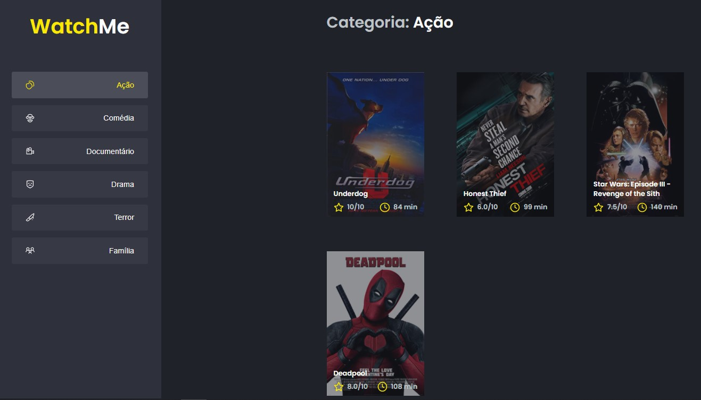

#



# <div align="center"> Desafio React Components </div>

#### <div align="right">- Projeto Finalizado <div>

### <div align="center"> Desafio de curso criado pela equipe Rocketseat abordando conceitos sobre: </div>

- HTML | CSS
- ReactJS: components
- ReactJS: hooks
- Json-server: fake API

## <div align="center"> Sumário </div>
<!--ts-->
   - [Requisitos](#<div-align="center">Requisitos</div>)
   - [Tecnologias utilizadas](#<div-align="center">Tecnologias-utilizadas</div>)
   - [Autor](#<div-align="center">Autor</div>)
<!--te-->
## <div align="center">Requisitos</div>
Para executar a aplicação é necessário instalar algumas ferramentas tais como um editor de códigos para realizar compilação dos mesmos. Nesse projeto foi utilizado o [Visual Studio Code](https://code.visualstudio.com/), [NodeJS](https://nodejs.org/en/) para compilação do código, [Git Bash](https://gitforwindows.org/) para baixar o repositório e baixar todas as dependências necessárias. 

```bash
# Baixe o repositório.
$ git clone https://github.com/Ricnaga/react-component.git

# Acesse a pasta do projeto.
$ cd react-component

# Agora que baixou e acessou o repositório, vamos começar a instalação das dependências.
$ yarn ( caso não utilize o yarn execute apenas npm -i)

# Depois de instalado todas as dependências, abra a aplicação via vscode
$ code .

# Agore execute a aplicação.
$ yarn dev (caso não utilize o yarn: npm run dev)

# Necessário também executar a api para que oconteúdo possa ser apresentado.
$ yarn server (caso não utilize o yarn: npm run server)

# A aplicação iniciará na porta 8080 
# No navegador digite: http://localhost:8080
```

##  <div align="center">Tecnologias utilizadas</div>
- [HTML](https://www.w3.org/HTML)
- [NodeJS](https://nodejs.org/en/)
- [Git Bash](https://gitforwindows.org/)
- [Typescript](https://www.typescriptlang.org/)
- [React JS](https://pt-br.reactjs.org/)
- [Json-server](https://github.com/typicode/json-server)


## <div align="center">Autor</div>
<div align="center">Atividade desenvolvida no curso ignite pela equipe <a href="https://rocketseat.com.br/">Rocketseat</a>, realizados por minha pessoa.
Gostou? tem alguma sugestão de melhoria? por favor, entre em contato e ja aproveita e me adiciona.<br>
<a href="https://www.linkedin.com/in/ricardo-nagatomy-56553254"></a>
<a href="https://app.rocketseat.com.br/me/ricardo-nagatomy-08130"></a>
</div>